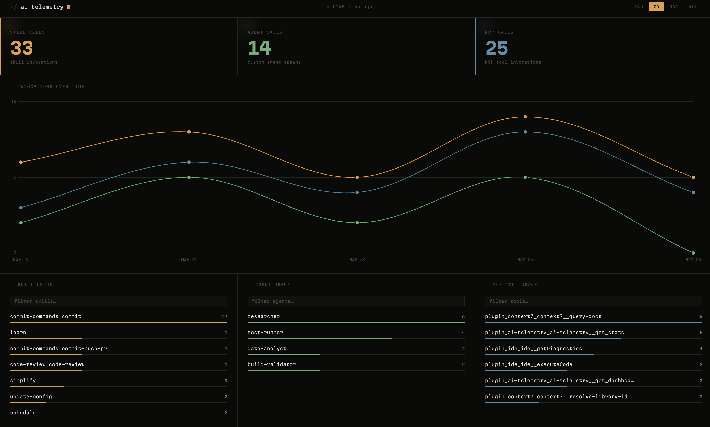

# ai-telemetry

A Claude Code plugin that automatically tracks skill, agent, and MCP tool usage across all your Claude Code sessions and serves a live dashboard.



## What it does

- **Auto-tracks** every skill invocation, custom agent spawn, and MCP tool call via a PostToolUse hook — no manual instrumentation needed
- **Persists data** to SQLite at `~/.ai-telemetry/events.db`, survives plugin reinstalls
- **Live dashboard** at `http://localhost:8765` with:
  - Skill / Agent / MCP call counts (click a card to isolate that dataset in the chart)
  - Timeline chart showing usage over time
  - Leaderboards: Skill Usage · Agent Usage · MCP Tool Usage
  - Recent event feed with hostname and project context
- **Period filters**: 24H · 7D · 30D · ALL
- **Multi-session aware**: the HTTP server runs as a background daemon shared across all Claude Code sessions — it starts with the first session and shuts down only after all sessions have exited

## Requirements

- Node.js 22.5+
- Claude Code with plugin support

## Installation

### 1. Add the marketplace

```bash
claude plugin marketplace add https://github.com/simararora7/ai-telemetry
```

### 2. Install the plugin

```bash
claude plugin install ai-telemetry@ai-telemetry
```

### 3. Restart Claude Code

The plugin starts automatically on next launch. Open the dashboard at:

```
http://localhost:8765
```

## MCP Tools

The plugin exposes two MCP tools that Claude can use directly within a session:

| Tool | Description |
|------|-------------|
| `get_stats` | Returns usage stats (skills, agents, MCP calls) for a given period — `24h`, `7d`, `30d`, or `all` |
| `get_dashboard_url` | Returns the URL to open the live dashboard in a browser |

Example: _"Show me my most-used skills this week"_ — Claude will call `get_stats` with `period: "7d"` and summarise the results.

## Tracked events

| Type | What's captured |
|------|----------------|
| `skill` | Skill name and arguments |
| `agent` | Custom agent name (built-in agents are excluded) |
| `mcp` | MCP server and tool name |

Each event records: session ID, working directory, hostname, and timestamp.

## Data

All data is stored locally at `~/.ai-telemetry/events.db`. Nothing is sent externally.

## Uninstall

```bash
claude plugin uninstall ai-telemetry
```

Your data at `~/.ai-telemetry/events.db` is preserved.
